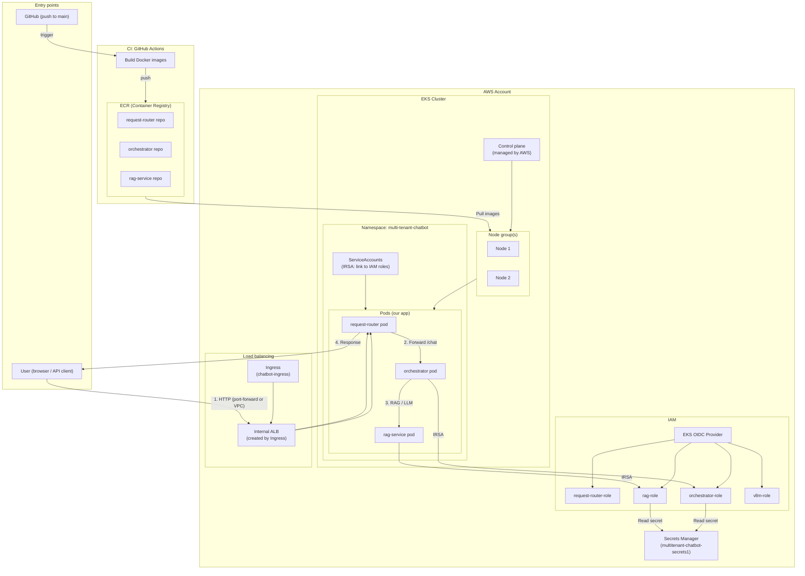
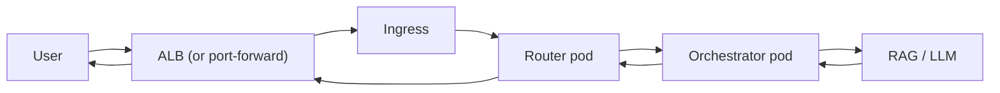
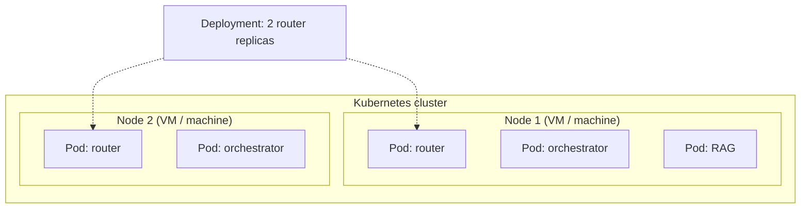

# AWS & Kubernetes Guide: Multi-Tenant Chatbot

This document explains **Docker**, **Kubernetes**, what we do in this project, and how the AWS pieces fit together—with a Mermaid graph of the AWS flow from entry to exit.

---

## Table of contents

1. [What is Docker?](#1-what-is-docker)
2. [What is Kubernetes?](#2-what-is-kubernetes)
3. [What we're doing in this project](#3-what-were-doing-in-this-project)
4. [AWS flow: Mermaid graph](#4-aws-flow-mermaid-graph)
5. [Component-by-component explanation](#5-component-by-component-explanation)
6. [Multi-user, concurrent requests, and scalability](#6-multi-user-concurrent-requests-and-scalability)
7. [Ingress, Node vs Pod, and vLLM vs EKS](#7-ingress-node-vs-pod-and-vllm-vs-eks)

---

## 1. What is Docker?

**Docker** is a platform to build, ship, and run applications inside **containers**.

- **Container**: A lightweight, standalone runnable package that includes your app plus its dependencies (e.g. Python, libraries). It runs the same way on your laptop, CI, or the cloud.
- **Image**: A read-only template used to create containers. Built from a **Dockerfile** (instructions like “use Python 3.11”, “copy code”, “run this command”).
- **Registry**: A store for images. We use **Amazon ECR** so EKS can pull our images.

In this project we have three Dockerfiles (router, orchestrator, RAG). GitHub Actions builds images from them and pushes to ECR. EKS then runs those images as containers inside pods.

---

## 2. What is Kubernetes?

**Kubernetes (K8s)** is an orchestrator for **containers**: it schedules where they run, keeps them healthy, and exposes them to traffic.

Core concepts:

| Concept | What it is |
|--------|------------|
| **Cluster** | A set of machines (nodes) managed by Kubernetes. |
| **Node** | A single machine (VM or physical) that runs pods. |
| **Pod** | The smallest runnable unit: one or more containers that share network and storage. |
| **Deployment** | Declares “I want N replicas of this app.” K8s creates/updates pods to match. |
| **Service** | Stable network name and load balancing for pods (e.g. `request-router-service:8000`). |
| **Namespace** | Logical grouping (e.g. `multi-tenant-chatbot`) for isolation. |
| **Ingress** | Rules for external/HTTP traffic into the cluster (we use it to create an ALB and route `/` to the router). |
| **ConfigMap / Secret** | Configuration or sensitive data injected into pods. |

We run the chatbot as **Deployments** (router, orchestrator, RAG, vLLM) and **Services** inside one **Namespace**, with an **Ingress** that creates an internal **ALB** as the entry point for HTTP.

---

## 3. What we're doing in this project

We run a **multi-tenant chatbot** on **AWS**:

- **Router**: Entry point; checks tenant, rate limits, guardrails; forwards to orchestrator.
- **Orchestrator**: Classifies intent (price / finance / diet / general), calls RAG or MCPs, calls LLM; returns one answer with optional citations.
- **RAG service**: Vector search over tenant/user vault (FAISS); used for diet/nutrition answers.
- **vLLM** (optional): GPU inference; we keep it scaled to 0 if you have no GPU nodes.

Traffic flow: **User → (port-forward or Internal ALB) → Ingress → Router → Orchestrator → (RAG / MCP / LLM) → back to user.**

We use **IRSA** so pods get short-lived AWS credentials (no long-lived keys). We store **OPENAI_API_KEY** and similar in **Secrets Manager**; pods read them via IRSA. **GitHub Actions** builds Docker images and pushes to **ECR**; **EKS** pulls those images to run the pods.

---

## 4. AWS flow: Mermaid graph

The diagram below shows the **AWS-side flow**: who/what hits AWS, how EKS and supporting services connect, and where the response goes back.



**Simplified “request path” (user → AWS → exit):**



---

## 5. Component-by-component explanation

Each box in the AWS flow is explained below in order of how you’d set things up or how a request flows.

---

### Entry points

- **User (browser / API client)**  
  Sends HTTP requests to the chatbot. From outside the VPC you use **kubectl port-forward** to the router service; from inside the VPC you use the **Internal ALB** hostname (from the Ingress).

- **GitHub (push to main)**  
  Triggers the **Build and push images to ECR** workflow. That’s the CI entry point into AWS (build → push to ECR).

---

### CI: GitHub Actions

- **Build Docker images**  
  Uses the repo’s Dockerfiles to build the router, orchestrator, and RAG images, then pushes them to ECR. No Docker needed on your laptop.

- **ECR (Elastic Container Registry)**  
  AWS’s container registry. Holds the three image repos (request-router, orchestrator, rag-service). EKS nodes pull these images when starting pods.

---

### IAM

- **EKS OIDC Provider**  
  Lets EKS issue short-lived tokens to pods. When you create IRSA roles, you choose “Web identity” and this OIDC provider so that only your cluster’s service accounts can assume the roles.

- **request-router-role, orchestrator-role, rag-role, vllm-role**  
  **IRSA roles**: each role is assumed by pods using a specific **ServiceAccount**. Permissions (e.g. read Secrets Manager, write CloudWatch) are attached to these roles, not to long-lived keys.

---

### Secrets Manager

- **multitenant-chatbot-secrets1**  
  One secret with key/value pairs (e.g. `OPENAI_API_KEY`, `LANGSMITH_API_KEY`). The orchestrator and RAG pods load these at startup via IRSA (`GetSecretValue`). No need to bake keys into images or use many separate secrets.

---

### EKS cluster

- **Control plane**  
  Managed by AWS. Schedules pods, manages the API, etc. You don’t manage servers for it.

- **Node group(s)**  
  The EC2 (or Fargate) instances that run your pods. We use node groups that can have taints (e.g. `CriticalAddonsOnly`); pods need matching tolerations to run there. Node groups pull images from ECR.

- **Namespace: multi-tenant-chatbot**  
  All our resources (router, orchestrator, RAG, vLLM, ingress, services) live in this namespace for isolation and clarity.

- **Pods (request-router, orchestrator, rag-service)**  
  Each is one or more containers running our code. They’re created by **Deployments** and addressed by **Services** (e.g. `request-router-service:8000`).

- **ServiceAccounts (IRSA)**  
  Each deployment uses a ServiceAccount that has an annotation `eks.amazonaws.com/role-arn: arn:aws:iam::...:role/...`. That links the pod to an IAM role so it can call Secrets Manager, CloudWatch, etc., without access keys.

---

### Load balancing

- **Ingress (chatbot-ingress)**  
  A Kubernetes resource that says “send HTTP traffic for `/` to the router service.” The AWS Load Balancer Controller creates an **Internal ALB** to satisfy this Ingress.

- **Internal ALB**  
  The actual load balancer in your VPC. It receives HTTP traffic (or traffic forwarded via port-forward) and sends it to the router pods. “Internal” means it’s not exposed to the public internet; only clients in the VPC (or via port-forward from your machine) can reach it.

---

### Request path (user → exit)

1. **User** sends a request (e.g. POST `/chat`) to the ALB (or to `localhost:8000` when using port-forward to the router service).
2. **ALB** forwards to the **Ingress** backend: the **request-router** service.
3. **Router pod** checks tenant, rate limit, guardrails; then forwards the request to the **orchestrator** service.
4. **Orchestrator pod** classifies intent, calls RAG and/or LLM (and optionally MCPs), builds the answer.
5. **RAG pod** (if needed) runs vector search; **orchestrator** uses **IRSA** to read **Secrets Manager** for API keys.
6. Response flows back: **orchestrator → router → ALB → user**. That’s the **exit** of the request path.

---

### Summary table

| Component | Role in AWS flow |
|----------|-------------------|
| **User / GitHub** | Entry: traffic or CI trigger. |
| **GitHub Actions** | Builds images, pushes to ECR. |
| **ECR** | Stores Docker images; EKS pulls from here. |
| **IAM OIDC + IRSA roles** | Let pods assume roles and access Secrets Manager / CloudWatch. |
| **Secrets Manager** | Holds API keys; pods read via IRSA. |
| **EKS control plane** | Schedules and manages workloads. |
| **Node group** | Runs pods; pulls images from ECR. |
| **Namespace / Pods / Services** | Our app running inside the cluster. |
| **Ingress + ALB** | Entry for HTTP traffic; path from user to router. |
| **Router → Orchestrator → RAG** | Request path; response back to user is the exit. |

---

## 6. Multi-user, concurrent requests, and scalability

This section explains how the design handles **multiple users at the same time** (e.g. User-A in India and User-B in Canada), how **LLM calls** happen per request, and how **scalability** is built in.

---

### 6.1 Multi-user concept

- **Stateless design**: Each HTTP request carries everything needed to process it: `tenant_id`, `query`, and optional `history`. There is **no shared in-memory session** between users. User-A’s request and User-B’s request are independent.
- **Tenant isolation**: The router identifies the tenant (from header `X-Tenant-Id` or payload). Rate limits and guardrails are applied **per tenant**. User-A (tenant `t1`) and User-B (tenant `t2`) are limited separately.
- **No cross-request state**: The orchestrator builds a **fresh state dict** per request and invokes the LangGraph workflow with it. One user’s state never mixes with another’s.

So when User-A (India) and User-B (Canada) send queries at the same time, they are treated as **two separate requests** from start to finish.

---

### 6.2 How concurrent requests are handled

- **Async I/O**: The router and orchestrator use **FastAPI** (async). A single pod can handle many concurrent requests: while one request is waiting on the orchestrator or LLM, the event loop can serve another. So even with **1 replica** of router and orchestrator, User-A and User-B can be processed **concurrently** (not strictly one-after-the-other).
- **Kubernetes Services**: When you run **multiple replicas** (e.g. `kubectl scale deployment request-router --replicas=3`), the **Service** load-balances incoming requests across pods. User-A’s request may hit Router Pod 1 and Orchestrator Pod 1; User-B’s may hit Router Pod 2 and Orchestrator Pod 2. No coordination is needed; each request is self-contained.
- **LLM calls**: Each request triggers its **own** workflow run and its **own** HTTP calls to the LLM (e.g. OpenAI). So User-A’s LLM call and User-B’s LLM call are **separate API requests** to OpenAI and can run in parallel. OpenAI handles concurrency on their side (subject to your API key’s rate limits).

---

### 6.3 Sample timeline: User-A (India) and User-B (Canada) at the same time

Below is a **simplified timeline** when both users send a chat at roughly the same time. Time flows downward; both requests are in flight concurrently.

```mermaid
sequenceDiagram
    participant UA as User-A (India)
    participant UB as User-B (Canada)
    participant ALB as ALB / Ingress
    participant R1 as Router Pod 1
    participant R2 as Router Pod 2
    participant O1 as Orchestrator Pod 1
    participant O2 as Orchestrator Pod 2
    participant RAG as RAG Service
    participant LLM as OpenAI API

    Note over UA,LLM: T=0s — Both users send POST /chat

    UA->>ALB: POST /chat (tenant t1, query "diet tips")
    UB->>ALB: POST /chat (tenant t2, query "stock AAPL")
    ALB->>R1: Request A
    ALB->>R2: Request B

    R1->>R1: Rate limit, guardrails (t1)
    R2->>R2: Rate limit, guardrails (t2)
    R1->>O1: Forward /chat (A)
    R2->>O2: Forward /chat (B)

    par Orchestrator A and B run in parallel
        O1->>O1: Intent: DIET_QUERY
        O2->>O2: Intent: FINANCE_QUERY
        O1->>RAG: GET /retrieve (A)
        O2->>O2: MCP finance (or refusal)
        RAG-->>O1: Chunks (A)
        O1->>LLM: Chat completion (A)
        O2->>LLM: Chat completion (B)
        LLM-->>O1: Response (A)
        LLM-->>O2: Response (B)
        O1->>O1: Build answer (A)
        O2->>O2: Build answer (B)
    end

    O1->>R1: 200 + answer (A)
    O2->>R2: 200 + answer (B)
    R1->>UA: Response (A)
    R2->>UB: Response (B)

    Note over UA,LLM: T≈2–5s — Both responses delivered; order depends on latency
```

**What this shows:**

| Time | What happens |
|------|-------------------------------|
| **T=0** | User-A and User-B each send a POST `/chat`. ALB (or K8s Service) may send them to different router pods if replicas &gt; 1. |
| **T=0+** | Each router checks **per-tenant** rate limit and guardrails, then forwards to an orchestrator pod. |
| **T=0+** | Orchestrator Pod 1 runs the graph for User-A (intent → RAG → LLM). Orchestrator Pod 2 runs the graph for User-B (intent → finance/refusal → LLM). **No shared state.** |
| **T=0+** | RAG is called only for the diet query (A). LLM (OpenAI) receives **two independent** API calls—one for A, one for B—and can process them in parallel. |
| **T≈2–5s** | Each orchestrator returns its answer to its router; each router returns the response to the correct user. Response order depends on latency (RAG, LLM, network), not on who sent first. |

So: **requests are handled concurrently**; **LLM calls happen per request in parallel**; **scalability** comes from async I/O plus horizontal scaling of router and orchestrator pods.

---

### 6.4 How scalability is taken care of in our design

| Aspect | How it’s done |
|--------|-------------------------------|
| **Stateless services** | Router and orchestrator do not store per-user session in memory. Any replica can serve any request. You can add more replicas and the Service load-balances. |
| **Horizontal scaling** | Increase replicas for router and orchestrator when load grows: e.g. `kubectl scale deployment request-router --replicas=5` and `kubectl scale deployment orchestrator --replicas=5`. |
| **Async I/O** | Each pod can handle many concurrent connections. While one request waits on the LLM or RAG, the same pod can work on other requests. |
| **Per-tenant rate limits** | Rate limiting is per tenant (in-memory in the router today; in production you’d use Redis or DynamoDB). This prevents one tenant from starving others and helps the system scale predictably. |
| **External LLM** | Using OpenAI (or similar) means we don’t scale GPU inference ourselves. Our scaling is about **router + orchestrator + RAG** replicas and async concurrency. |
| **Optional HPA** | You can add a Horizontal Pod Autoscaler (HPA) on CPU or custom metrics so the number of replicas grows/shrinks with load. See [infrastructure/kubernetes/README.md](../infrastructure/kubernetes/README.md) for manual scaling commands. |

So: **multi-user** is handled by stateless, per-request processing and per-tenant isolation; **concurrent requests** are handled by async I/O and (when replicas &gt; 1) load-balanced pods; **LLM calls** happen once per request and can run in parallel for different users; **scalability** is achieved by adding replicas and, optionally, HPA.

---

## 7. Ingress, Node vs Pod, and vLLM vs EKS

This section gives **more coverage** on: (1) **Ingress**—what it is and how we use it; (2) **Node vs Pod**—whether a node is a superset of a pod, whether a pod runs inside a node, and whether 1 node = 1 pod; (3) **Role of vLLM**—GPU vs orchestration, and how that differs from EKS orchestration.

---

### 7.1 Ingress (more coverage)

**What is Ingress?**

- **Ingress** is a Kubernetes **resource** (an API object). It does **not** send traffic by itself. It describes **rules** for how HTTP/HTTPS traffic from outside the cluster should be routed to **Services** inside the cluster.
- Think of it as: “When someone hits this host/path, send the request to this Service.” The **Ingress controller** (in our case, the **AWS Load Balancer Controller**) reads these rules and **configures a real load balancer** (an **ALB**) so that traffic actually flows that way.

**How it works in our project**

1. We create an **Ingress** object named `chatbot-ingress` in the namespace `multi-tenant-chatbot`.
2. We set **annotations** so the AWS Load Balancer Controller creates an **Application Load Balancer (ALB)** and wires it to our Ingress rules.
3. The Ingress **spec** says: “For path `/` (and anything under it), send traffic to the Service `request-router-service` on port 8000.”
4. The controller creates an **internal ALB** in our VPC, registers the router Service’s pods as targets, and keeps health checks and routing in sync.

So the flow is: **User → ALB (created because of Ingress) → request-router-service → router pods.** The Ingress is the “contract”; the ALB is the “implementation.”

**Our Ingress YAML (high level)**

| Part | Purpose |
|------|---------|
| `ingressClassName: alb` | Use the AWS ALB Ingress controller. |
| `alb.ingress.kubernetes.io/scheme: internal` | Create an **internal** ALB (not internet-facing). Only reachable from inside the VPC (or via kubectl port-forward from your machine). |
| `alb.ingress.kubernetes.io/target-type: ip` | Register **pod IPs** as ALB targets (not node ports). |
| `alb.ingress.kubernetes.io/listen-ports: '[{"HTTP": 80}]'` | ALB listens on port 80 (HTTP). |
| `rules` → `path: /` → `request-router-service:8000` | All requests to `/` (and subpaths like `/chat`, `/health`) go to the router Service. |
| Health-check annotations | ALB uses `/health` on the router to decide which pods are healthy. |

**Summary:** Ingress = rules for “where should HTTP traffic go?” The AWS controller turns those rules into an ALB that forwards traffic to the router Service (and thus to router pods). We do **not** use Ingress for pod-to-pod traffic inside the cluster (that’s what **Services** are for).

---

### 7.2 Node vs Pod: is Node a superset of Pod? Does Pod run inside Node? Is 1 node = 1 pod?

**Short answers**

- **Is a Node a superset of a Pod?** In a containment sense, **yes**: a **Node** is the **machine** (VM or physical server); **Pods run on Nodes**. So the Node “contains” the Pods that run on it. The Node is not a Kubernetes object that “wraps” a single Pod; it’s the host where many Pods can run.
- **Does a Pod run inside a Node?** **Yes.** A Pod runs **on** a Node. The Kubernetes **scheduler** places each Pod on some Node. The Node provides CPU, memory, and (if applicable) GPU; the Pod’s containers execute on that Node.
- **Is 1 node = 1 pod?** **No.** One Node can run **many** Pods. Typically you have far fewer Nodes than Pods: e.g. 2–10 Nodes and dozens of Pods (router, orchestrator, RAG, system pods, etc.). The scheduler packs multiple Pods onto each Node subject to resource requests and limits.

**Relationship in one picture**



- **Node** = the box (the machine). It has OS, kubelet, container runtime; it runs many Pods.
- **Pod** = the smallest runnable unit we schedule. One or more containers share the Pod’s network and storage. Pods run **inside** (on) Nodes.
- **Deployment** = “I want N replicas of this app.” Kubernetes creates Pods to match; the **scheduler** decides **which Node** each Pod runs on. So: **Nodes don’t create Pods**; the **control plane** (via Deployments, etc.) creates Pods, and the **scheduler** assigns each Pod to a Node.

**Summary:** Node = host machine. Pod = workload unit that runs **on** a Node. One Node runs many Pods. 1 node = 1 pod is **not** the model; we have **many Pods per Node** (and optionally many replicas of the same app spread across Nodes).

---

### 7.3 Role of vLLM: GPU inference only, or orchestration? What orchestration does EKS do?

**What is vLLM?**

- **vLLM** is an **inference server** for large language models (LLMs). You run it as a service that loads a model (e.g. Mistral, Llama) and exposes an **API** (often OpenAI-compatible) so other services can send prompts and get completions.
- It is built for **GPU** use: it uses GPU memory and compute for fast inference. In our manifests we use `nodeSelector: node-type: gpu` and `nvidia.com/gpu: 1` so the vLLM **pod** runs only on **GPU nodes**. So in this project, **vLLM is for GPU-based LLM inference**, not for orchestration.

**Is vLLM for “orchestration”?**

- **No.** vLLM does **not** orchestrate your app. It does one job: **run the model and answer inference requests**. It does not decide intent, call RAG, or route between tools. Our **orchestrator** (the Python service in `src/app/` and `src/orchestration/`) does that: it classifies intent, calls RAG or MCPs, and then calls **either** an external LLM (e.g. OpenAI) **or** an internal vLLM endpoint to get the final text. So:
  - **Orchestrator (our service)** = application logic: intent, RAG, tools, and “who to call for the LLM answer” (OpenAI vs vLLM).
  - **vLLM** = optional **backend** that can replace or sit alongside OpenAI for **inference only** (run the model on our own GPU).

**What does EKS “orchestrate” then?**

- **EKS (Kubernetes)** orchestrates **infrastructure and workload placement**: **where** Pods run (which Node), **how many** replicas, **networking** (Services, Ingress), **scaling**, **restarts**, etc. It does **not** know about “intent” or “RAG”; it just runs our containers and keeps them healthy.
- So we have two different meanings of “orchestration”:
  1. **App-level orchestration** = our **orchestrator service**: coordinates intent → RAG / tools → LLM (OpenAI or vLLM) and returns one answer.
  2. **Infrastructure orchestration** = **EKS**: schedules Pods on Nodes, creates Services and Ingress, scales replicas, manages the cluster.

**In one sentence:** vLLM is for **GPU LLM inference**; our **orchestrator** is for **application flow** (intent, RAG, tools, LLM); **EKS** is for **running and placing** those services (Pods on Nodes, load balancing, scaling).

---

If you want to go deeper, see:

- **Kubernetes**: [infrastructure/kubernetes/README.md](../infrastructure/kubernetes/README.md)
- **AWS setup**: [infrastructure/SETUP_YOUR_ACCOUNT.md](../infrastructure/SETUP_YOUR_ACCOUNT.md)
- **Deployment summary**: [DEPLOYMENT_SUMMARY.md](../DEPLOYMENT_SUMMARY.md)
